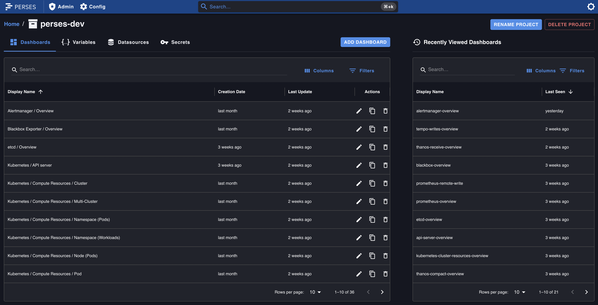
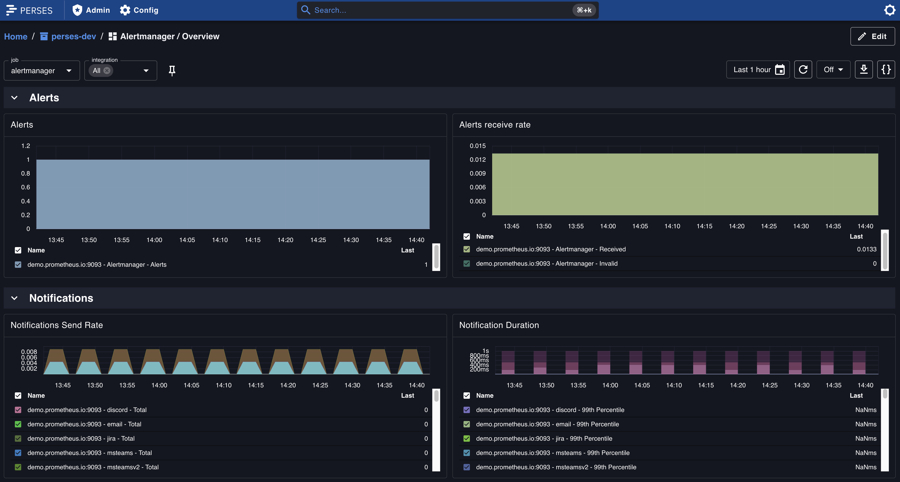

# Composable Dashboards -  Lessons from building Perses Community Dashboards

## Why we keep rewriting the same dashboards

Every CNCF User/Developer/Contributor has, at some point, to endure the frustration of trying to salvage an outdated dashboard, or adapting upstream YAML, only to get to the point of wondering why it doesn't work on their setup. This leads to a recurring pattern: everyone ends up rebuilding the same dashboards, over and over again, each slightly different.

The Mixins Dashboards helped bring about a sense of relief, as users now could use dashboards and alerts packaged together with the code they are deployed with. In theory, this promised consistency and easier integration. In practical terms, as the concept of mixins relies on Jsonnet, and even though it’s a suitable language for configuration management, it leads to a few issues:

* Jsonnet has a steep learning curve. It’s not a conventional Turing-complete programming language, and often makes it hard for downstream users of mixins to be able to do any sort of customization on their dashboards;

* Mixin Jsonnet is completely detached from the actual application code. It was introduced as a way to maintain dashboarding config for code that you are deploying side by side, to ensure it never goes out of sync. However, many mixins are rarely updated, even when the code is - sometimes these are maintained out of the tree. And Jsonnet cannot use Go structs, so there is no automatic validation during code changes. Thus keeping mixins accurate and reliable demands a lot of effort.;

* Adoption has also been uneven. A good example of this is kube-prometheus stack, built with Jsonnet, where many users bypass it entirely and only fetch the rendered YAML from that repository, then doing any sort of changes with tools like Kustomize instead. This undermines the original goal of reuse and standardization.

The end result is, that despite the promise of reusable dashboards, the reality is there’s still not a widely used solution for automatic dashboards creation.

## Perses KubeCon EU Recap - Maybe there’s a better way to build Dashboards 

During **KubeCon EU 2025** in London, two of Perses’ core maintainers, Nicolas Takashi and Antoine Thébaud, shared how Perses is changing the way engineers develop and manage dashboards as code. Their talk covered the power of the Open Dashboard Model, how to use strongly typed code with the Perses Go SDK, and why this approach fits naturally into CI/CD pipelines using modern GitOps practices. If you didn’t get a chance to watch it live, you can watch the full session [here](http://youtube.com/watch?v=7h70Olo5Uzk).

They also mentioned the **Community Dashboards** Project, but didn’t have time to dive into it during the session. With that in mind is our belief that such an important topic deserves more space, and as so we bring this into live here.

## Moving away from rebuilding the same dashboards to composable dashboards

With the limitations of mixins in mind, the Perses community decided to take a different path. Since Perses is written in Go, with both its configuration and plugins defined using Go structs, it presents an opportunity to design dashboards in a more efficient and structured way. This approach takes full advantage of the Go structs imported from Perses, with its robust SDK that has the methods and constructs to build dashboards. This then ensures consistency with the core project, safe versioning, both for the dashboard data model and each individual panel plugins, and type-safe dashboard construction and customization.

Introducing the [community-dashboards](https://github.com/perses/community-dashboards) repository. Maintained by community contributors, it offers the following dashboards in type-safe modular Go SDK based Dashboards as Code:



The goal of the community-dashboards library isn't just to provide ready-to-use YAML dashboards (though you can use them as-is), but to empower users to import the project as a Go module in their downstream configuration, generate tailored subsets of dashboards, and customize or extend them to meet specific needs (similar to what mixins originally intended).

A core strength of the Perses Community Dashboards is its modular, reusable panel library. These panels—such as Go CPU Usage and Memory Consumption—serve as building blocks that can be composed into new dashboards. Instead of starting from scratch, users can leverage these community-maintained components to quickly build dashboards suited to their applications and workloads.

This approach also lowers the barrier to achieving consistency across dashboards. By reusing the same patterns to build and display common metrics, dashboards remain aligned across teams and services. This makes it easier to compare environments, onboard new engineers, and scale observability practices—without reinventing the wheel.



## How to build composable dashboards - a practical example

Here we have an example of how to define a panel of Time Series type below. More detailed info about the available option for Time Series Panels can be found [here](https://pkg.go.dev/github.com/perses/plugins/timeserieschart) and [PromQLBuilder](https://pkg.go.dev/github.com/perses/promql-builder).

```go
// Define your panel
func CPUUsage(datasourceName string, labelMatchers ...*labels.Matcher) panelgroup.Option {
	return panelgroup.AddPanel("CPU Usage",
		panel.Description("Shows the CPU usage of the component."),
		timeSeriesPanel.Chart(
			timeSeriesPanel.WithYAxis(timeSeriesPanel.YAxis{
				Format: &commonSdk.Format{
					Unit: string(commonSdk.DecimalUnit),
				},
			}),
			timeSeriesPanel.WithLegend(timeSeriesPanel.Legend{
				Position: timeSeriesPanel.BottomPosition,
				Mode:     timeSeriesPanel.TableMode,
				Values:   []commonSdk.Calculation{commonSdk.LastCalculation},
			}),
			timeSeriesPanel.WithVisual(timeSeriesPanel.Visual{
				Display:      timeSeriesPanel.LineDisplay,
				ConnectNulls: false,
				LineWidth:    0.25,
				AreaOpacity:  0.5,
				Palette:      timeSeriesPanel.Palette{Mode: timeSeriesPanel.AutoMode},
			}),
		),
		panel.AddQuery(
			query.PromQL(
				promql.SetLabelMatchersV2(
					promqlbuilder.Rate(
						matrix.New(
							vector.New(
								vector.WithMetricName("process_cpu_seconds_total"),
							),
							matrix.WithRangeAsVariable("$__rate_interval"),
						),
					),
					labelMatchers,
				).Pretty(0),
				dashboards.AddQueryDataSource(datasourceName),
				query.SeriesNameFormat("{{pod}}"),
			),
		),
	)
}
```

Next after you have your first panel, it’s time to add it to a dashboard - here’s how to add to a dashboard named `Workload / Overview`:

```go
// Use the panel in a dashboard
func withResources(datasource string, clusterLabelMatcher *labels.Matcher) dashboard.Option {
	labelMatchersToUse := []*labels.Matcher{
		promql.JobVarV2,
	}
	labelMatchersToUse = append(labelMatchersToUse, clusterLabelMatcher)

	return dashboard.AddPanelGroup("CPU Usage",
		panelgroup.PanelsPerLine(1),
		panelgroup.PanelHeight(10),
		panelsGostats.CPUUsage(datasource, labelMatchersToUse...),
	)
}

// Build the dashboard and add the time series panel withResources
func BuildWorkloadOverview(project string, datasource string, clusterLabelName string) dashboards.DashboardResult {
	clusterLabelMatcher := dashboards.GetClusterLabelMatcherV2(clusterLabelName)
	return dashboards.NewDashboardResult(
		dashboard.New("workload-overview",
			dashboard.ProjectName(project),
			dashboard.Name("Workload / Overview"),
			dashboard.AddVariable("job",
				listvariable.List(
					labelvalues.PrometheusLabelValues("job",
						labelvalues.Matchers("workload_build_info{}"),
						dashboards.AddVariableDatasource(datasource),
					),
					listvariable.DisplayName("job"),
				),
			),
			withResources(datasource, clusterLabelMatcher),
		),
	).Component("workload")
}
```

For more on the SDK please check [perses/go-sdk](https://pkg.go.dev/github.com/perses/perses/go-sdk), and [community-dashboards](https://pkg.go.dev/github.com/perses/community-dashboards).

## Beyond Copy-Pasting - Cleaner and Smarter way to building Dashboards

Going back to the idea of copy-pasting raw YAML or JSON, although it might seem quicker, it leads to painful maintenance over time. The Go SDK offers a better path:

* **Type safety** - You get compile-time feedback if something is wrong. No more mystery errors buried in JSON blobs.
* **Reusability** - Define a panel once and reuse it wherever you want. Avoid duplication and drift.
* **Maintainability** -  When a panel definition needs an update, you can do it in one place and apply it across all dashboards.
* **CI/CD friendly** - Code is easier to version, review, and test. It fits naturally into modern GitOps workflows.

Combining the use of panel libraries and the SDK, you get a flexible and scalable way to manage dashboards, while saving time, reducing errors, and staying consistent across your observability stack. This allows a community of dashboards users to have their lives made easier with these features. 

Also considering the most commonly used dashboard across platforms and teams, like **Kubernetes**, **Prometheus** and exporters like **Node Exporter**, **Blackbox Exporter**, also projects like **Thanos** dashboards as it tends to be a power duo within the Prometheus ecosystem, we have from the get go some core dashboards that will help you in the long term in your observability journey.

## Next Steps for the Community Dashboards

We’re committed to expanding support for more CNCF and other OSS projects while continuing to enhance the existing panel libraries. By adding more features and improving the quality of reusable panels, we enable users to gain deeper insights from their dashboards because the faster you can pinpoint an issue in your telemetry data, the better.

Also, we aim to ensure proper documentation for all dashboards. Whether you're importing full dashboards or using panel libraries as building blocks, we want to make the process as seamless as possible. That means clear, well-commented code and guidance, so modularity is not only guaranteed but also easy to work with, without needing to dig through the entire codebase.

Ultimately, this is a community effort, and we invite everyone to help grow this project. So if you have a dashboard you’ve rewritten more than once, or any mixin dashboard you use, but want to ensure it becomes modular, easily used and want to increase adoption of it. Whether it’s opening an issue or submitting a contribution, all help is moving forward so we can all, very soon, stop rebuilding the same dashboards. 

Let’s stop duplicating efforts and start building shared observability standards! 
