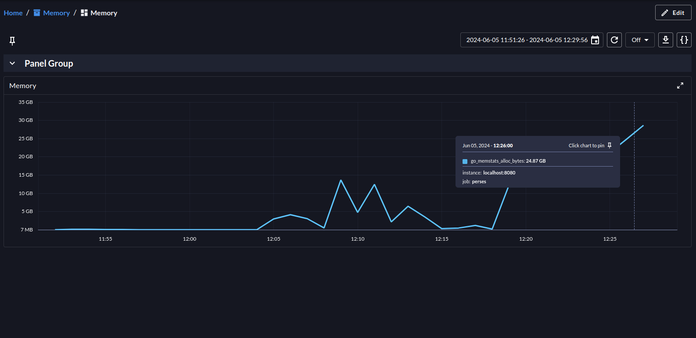
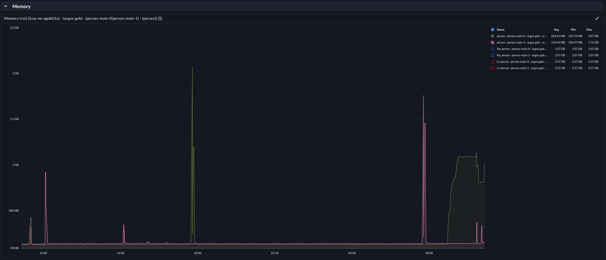
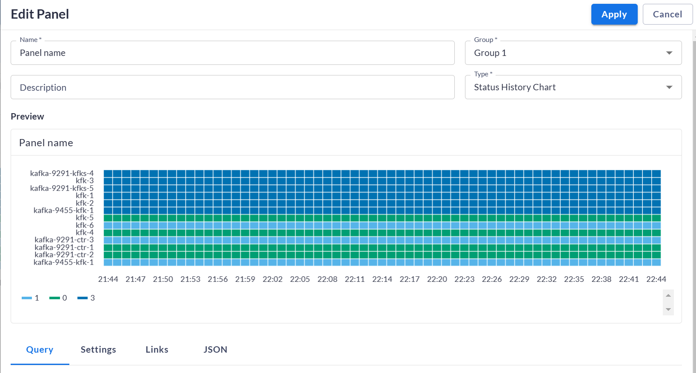
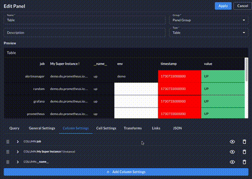

# Release v0.50.0

## Migration

One of the greatest contents of this release is the migration that has been drastically improved.

Since the beginning of the project, we have been willing to provide an easy way to migrate dashboards from Grafana to
Perses. As a reminder, you can migrate a Grafana dashboard using the HTTP endpoint `/api/migrate` or the UI or the CLI
that consumes this endpoint.

The big issue with this feature was the memory leak that was hidden and not that easy to trigger.
(See [issue #2039](https://github.com/perses/perses/issues/2039))

This was a big blocker for the migration and one of the main reasons why Amadeus was not able to migrate to Perses.
Amadeus has a huge number of dashboards, and the memory leak was too important to be ignored.
To give you an idea, the memory leak was about **40GB** after migrating **3000 dashboards**. (~ 3MB per dashboard)

As you may know, we are using Cuelang for the Perses plugin validation, and at first, we implemented a complete way to
migrate using Cuelang only.
The idea behind was to append every migration script (one for each panel, variable, queries) to the main one.
Then the Grafana JSON was converted to a Cuelang value, and we were applying the migration script to this value.

With the v0.50.0, we are changing deeply and only internally the way it's working. It doesn't change anything for the
user, but it's a huge improvement for the maintainability and the performance of the migration.

We have entirely rewritten the migration process. It is now using a hybrid system partially written in Golang and the
rest in Cuelang when the plugins are involved. Thanks to this new system, the Cuelang files written to migrate the
panels, the variables, and the queries can be validated and tested before the migration is applied.

Thanks to this change, we are happy to announce the memory leak has been fixed and the migration is now working
perfectly. We performed some benchmarks through the Amadeus infrastructure, now we are able to migrate their 3000
dashboards **without exceeding 3GB of memory**

Finally, we’ve also addressed numerous updates to the migration process itself, incorporating fixes and enhancements to
better cover use cases raised by the community - thank you for your contributions!

## Status History panel

Thanks to [Alexander Belyakin](https://github.com/abelyakin) from the community, Perses is supporting a new Panel: the
Status History Panel.

The Status History panel provides a visual representation of the status of various metrics over time.
It allows users to track changes in the status of different metrics, making it easier to identify patterns, trends, and
anomalies.
This panel is particularly useful for monitoring the health and performance of systems, as it can display status changes
in a clear and concise manner.
The panel can be customized to show different statuses, such as up, down, warning, or any other user-defined states, and
it supports various visualization options to enhance the readability of the data.

And of course, this panel is fully compatible with the migration process.

## General Improvements

### UI

We have finally added the redirection to the initial URL after you are authenticated. This was definitely a missing
feature annoying for the users.

This release also introduces various improvements to the **Table Panel**, such as debounced text fields in the editor,
default column sorting, custom column ordering, default column width setting, and cell focus on hover.

### CLI

First, we have fixed the login command not working if you were using the CLI to log in to different Perses servers.

Then, based on the community feedback, we also have improved the DAC (Dashboard as Code) sub-command.
We hope the experience with our DAC framework will be better.

We are also introducing new commands for plugin development.
That's something that comes along with the new plugin architecture we are working on since last year.
These commands cannot be used currently as we are still working on the plugin architecture.

But stay tuned as we are really close to finishing this intense work! **V0.51.0** is going to be incredible with a lot
of changes!
