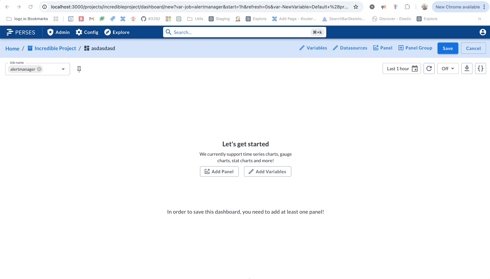
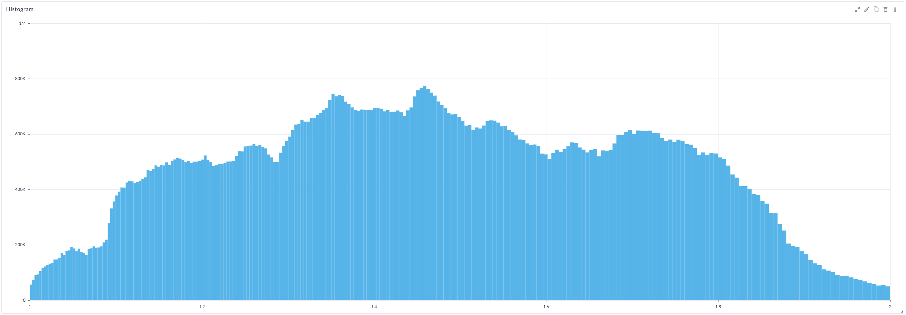
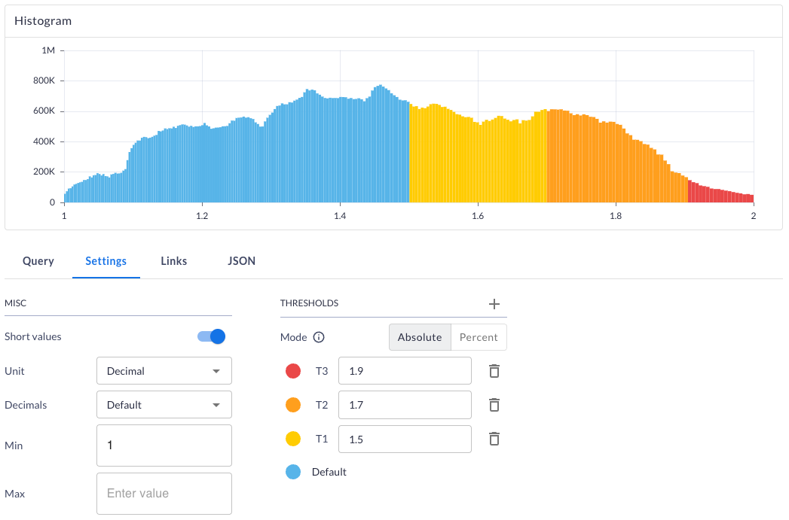
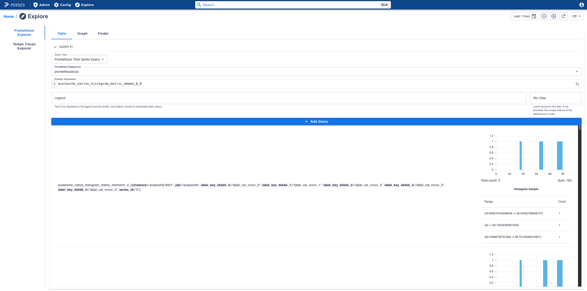

# Release v0.51.0

We are excited to announce the release of Perses v0.51.0!

This release brings several new features, improvements, and bug fixes to enhance your experience with Perses.

It is a significant step forward in the evolution of Perses, and we are thrilled to share it with you. We have
been working hard to bring you a more powerful and flexible platform for your observability needs.

This release includes a new plugin architecture, new panel, new variable, a new repository [perses/plugins](https://github.com/perses/plugins)
containing all default plugins supported by Perses.

We have also made significant improvements to the documentation, highlighting features that were implemented some time
ago but not well advertised, such as datasource discovery and ephemeral dashboards.

## New Plugins system

Big news from us at Perses! We've rolled out a brand-new plugin system, and it's all about making things more flexible
and expandable.
Our goal? To provide a more flexible and extensible way to scaffold, develop and distribute plugins in Perses so we can
expand the possibilities for sources of data, visualization and interactions within the platform.

### What's Under the Hood?

Leveraging [module federation](https://rspack.dev/guide/features/module-federation) plugins can now operate
independently of the main Perses code.
Opening up a world of possibilities for developers to create and share plugins without being tied down to the core
codebase.
Plugins can be grouped into **Plugin Modules**, which are essentially collections of related plugins that can be
developed and distributed together.
Underneath it all, the system has a backend that handles data validation and migrations using Cuelang schemas, and a
frontend that brings everything to life with React components.

### Easier Plugin Development

To make life easier for developers, we've built some handy `plugin` commands right into our command-line interface,
[`percli`](https://perses.dev/perses/docs/cli/).
The CLI will do all the heavy lifting from setting up your project, getting your development environment ready, to
building your plugins.
That way, you can kick back and focus on the exciting part: actually creating awesome plugin features!

### How Does It Work?

The new plugin system is designed to be super user-friendly.
You can scaffold a plugin using the `percli plugin generate` command, which will set up the new plugin files for you.
This command can be used several times to create multiple plugins in the same plugin module.
Then you can start developing your plugin using `percli plugin start` to run it in development mode and test it out in
your local Perses instance. Finally, compile it with `percli plugin build` to prepare it for distribution.

You can follow the [documentation](https://perses.dev/perses/docs/plugins/creation) for details and examples to get
started with creating your own plugins.

### Where to Find Plugins

Thanks to this new setup, our main Perses plugins have moved to their own dedicated home
at [perses/plugins](https://github.com/perses/plugins). And speaking of plugins, the system supports a bunch of
different types:

- Datasource: Perfect for grabbing data from all sorts of places.
- Query: This one links your datasources to your panels.
- Panel: Your go-to for making data look good through various visualizations.
- Variable: For when you need dynamic values in your queries.
- Explore: A special kind of panel designed for diving deep into your data.

You just use `percli` to get started, test your creations, and then build them up to distribute as archive files or npm
packages.
After that, they're ready to be installed on a Perses server or even embedded directly into other React apps.

So, what kind of plugin are you dreaming of building first?

## Breaking Change in Dashboard as Code

As previously mentioned, we have relocated the default plugins to a new repository. This includes not only the frontend
code, which has been transferred there, but also the corresponding Go SDK and CUE SDK for each plugin.

This move is a breaking change for the Dashboard as Code feature as when upgraded to the last version, you will no
longer have the plugin code from perses/perses repository.

All imports will have to be updated to point to the new repository. We created a module for each plugin so you can
import only the ones you need.

For example, in Go SDK, in case you are using the plugin `label-values` from the `Prometheus` module, you will need to
`go get` the plugin first:

```bash
go get github.com/perses/plugins/prometheus
```

Then, in your Go code, you will have to change the import path from:

```go
import labelValuesVar "github.com/perses/perses/go-sdk/prometheus/variable/label-values"
```

to:

```go
import labelValuesVar "github.com/perses/plugins/prometheus/sdk/go/variable/label-values"
```

As a complete example, this PR: https://github.com/perses/community-dashboards/pull/69 is demonstrating the required
changes you will have to do in your code when upgrading to the v0.51.0 of Perses.

In the case of CUE SDK, we are also leveraging on the new dependency management introduced by CUE v0.12.0.
Where we previously had a custom-made schema retrieval achieved by `percli dac setup`, Perses is now fully aligned with
the new [CUE modules](https://cuelang.org/docs/reference/modules/).

To continue using the CUE SDK, you will need to update your CUE files to import the new modules, but also to **upgrade**
the
**cue** version you are using to at least **v0.12.0**.

## New Plugins

### Datasource variable

Thanks to the community contributions, we are introducing a new plugin: the **Datasource Variable**.
This plugin allows the possibility to use a datasource as a variable in your dashboard, specially in the queries of your
panels.

This is particularly useful when you have multiple datasources of the same type, such as multiple Prometheus instances,
and you would like to switch between them without having to modify each panel query.


Of course, this plugin is not limited to Prometheus; it can be used with any datasource.

Note: If you are familiar with Grafana this feature wont will feel particularly new to you.
It's a valuable addition to Perses, helping to bring feature parity and making it a strong alternative for those
considering or exploring a
transition.

### Histogram Chart

This release introduces a new plugin: the **Histogram Chart**. This plugin allows you to visualize Prometheus Native
Histograms, providing a clear and concise way to understand the distribution of your histogram buckets.



This panel is supporting thresholds, which allow you to colorize the chart based on specific values, making it easier to
understand your data.



This chart is also used in **TimeSeriesTable** panel to display histogram details, allowing the Explore page to display
histograms.



In next releases, we are planning to add exponential mode support, add support for Prometheus classic histograms and
summaries and thresholds on bucket counts.
Feel free to give us ideas on how to improve this plugin, with issues or discussions on
the [Perses GitHub repository](https://github.com/perses/perses).
Spoiler: the heatmap panel is coming next release 🤫

## Custom Lint rules

As you may know, to validate your dashboard, we have implemented a set of rules.
These rules are executed when you save your dashboard during the unmarshalling step from JSON or YAML or during the
validation of each plugin using Cuelang.

In this release, we have added the ability to create custom lint rules. This allows you to enforce specific standards or
practices within your organization.

These custom rules should be defined in the configuration file of your Perses instance, typically located at
`/etc/perses/config.yaml`. The rules are defined under the `dashboard.custom_lint_rules` section.

Here is an example of how to define custom lint rules for dashboards:

```yaml
dashboard:
  custom_lint_rules:
    - name: "Dashboard Naming Convention"
      target: "$.metadata.name"
      assertion: "value.matches('^[a-z]+(-[a-z]+)*$')"
      message: "Dashboard name must be all lowercase letters with hyphens only."
      disable: false

    - name: "At Least One Panel Exists"
      target: "$.spec.panels"
      assertion: "value.size() > 0"
      message: "Dashboard must contain at least one panel."
      disable: false
```

We are using the [JSONPath](https://goessner.net/articles/JsonPath/) syntax to target specific parts of the dashboard
JSON structure, and the assertion is a [CEL](https://github.com/google/cel-spec/blob/master/doc/langdef.md) expression.

To know more about the syntax of the rules, please refer to
the [documentation](https://perses.dev/perses/docs/configuration/custom-lint-rules)

## Disable datasource and variable

In Perses, it is possible to create datasource and variables at three different levels: global, project, and dashboard.

Usually, for security and governance reasons, you may want to prevent people to create datasource and variables at
various levels. For global and project levels, this is already possible using the RBAC system.

But before this release, it was not possible to disable the creation of datasource and variables at the dashboard level.

In this release, we are introducing the ability to disable the manipulation of datasources and variables at any level.
For that, you need to modify the configuration file of your Perses instance, and add the following section:

```yaml
datasource:
  global:
    disable: true
  project:
    disable: true
  disable_local: true
```

This configuration is preventing the usage of datasources at any level and disable the associated HTTP route in the
Perses proxy.

Of course, this config is silly because without datasources, you cannot use dashboards, but it is a good example of how
to disable datasources.

The same example applies for variables:

```yaml
variable:
  global:
    disable: true
  project:
    disable: true
  disable_local: true
```

## Improvement of the datasource discovery

One year ago, we introduced the datasource discovery feature, which allows you to automatically discover remote
datasources from the Kubernetes API or from a generic HTTP endpoint.
And so far we never got feedback about it until a couple of months ago when [SAP](https://www.sap.com/) started using
it.

### Overview

We didn't have the opportunity to highlight this feature, so here is a quick overview of how it works.

Datasource discovery is useful when you have a large number of datasources, and you don't want to manually register
them in your application. Note that this feature can only be used when registering Global Datasources.

We are supporting two types of discovery:

- **Kubernetes API**: This allows you to discover datasources that are registered in the Kubernetes API, such as
  Prometheus, Loki, and others. You can configure the discovery by specifying the namespace where the datasources are
  located, the label selector to filter the datasources and the type of the discovery you would like to use: service,
  pod, endpoint.
- **HTTP Endpoint**: This allows you to discover datasources from a generic HTTP endpoint. You can configure the
  discovery by specifying the URL of the endpoint. The endpoint should return a JSON array of Global Datasource.

If you want to learn more about this feature, please refer to
the [documentation](https://perses.dev/perses/docs/configuration/datasource-discovery/).

### Improvements

- We made a mistake about how the label selector was converted from the configuration file to the Kubernetes
  API. The label selector was not correctly formatted, which prevented the discovery from working properly.
- When converting a service to a global datasource, there was a corner case where the global datasource was not
  correctly created. And then Perses was not able to load the datasource.

Thanks to these little improvements, the datasource discovery feature is now more reliable and easier to use.

## Community Dashboards

Fresh off our talk at KubeCon EU 2025 in
London - [Limitless Possibilities, Consistent Design: Crafting Dashboards With Perses DAC](http://youtube.com/watch?v=7h70Olo5Uzk),
given by two perses maintainers, Nicolas Takashi and Antoine Thébaud, we are happy to introduce
the [community-dashboards](https://github.com/perses/community-dashboards) repository.

Here we provide support for commonly used Mixin Dashboards, like Prometheus, Kubernetes and Thanos, build on top of
**Dashboard as Code** capabilities provided by Perses. We’ll dive deeper into the community-dashboards in our upcoming
blog post, but starting today, you can begin using them right away — whether by:

* Importing them directly into your Perses instance;

* Using them as a starting point to build your own dashboards;

* Or reusing individual panels in your own dashboards-as-code workflows.

We're also welcoming the community to help us support and extent the community-dashboards. So if there are additional
dashboards you’d like to see supported, feel free to reach out to the team - or even better, help us extend the
supported dashboards with feedback or improvements to the dashboards. Your input helps shape what comes next!
