# Release v0.52.0

The release of Perses v0.52.0 introduces significant new features and improvements.

This update expands Perses' observability capabilities by introducing support for logging and continuous profiling,
along with new plugins for Pyroscope, Flame Chart, Loki, and log visualization.

Additional enhancements include a heatmap panel for Prometheus histograms, a quick query viewer, panel group variable repeat,
usability improvements, and upgraded CLI commands to streamline plugin development and schema testing.

<!-- more -->

## New profiling plugins

This release provides the support of Continuous Profiling through two plugins:

- **Pyroscope**: a datasource plugin for retrieving and handling data from a Pyroscope server.
- **Flame Chart**: a visualization plugin which contains 3 panels: Flame Graph, Table View and Series Chart.

### What is Continuous Profiling?

Continuous Profiling is a new observability signal, complementing the traditional logs, metrics, and traces. This
innovative approach provides a way of continuously measuring applications' resource consumption with code-level
granularity and low overhead. This signal generates excitement in the community for its ability to provide in-depth
visibility into production performance of applications.

### Panels

#### Flame Graph

The flame graph panel offers a simple and intuitive way to represent performance data, providing a hierarchical view
that let you zoom in on any stack for a detailed analysis. It helps to understand resource allocations (CPU,
Memory, ...) and bottlenecks within an application.

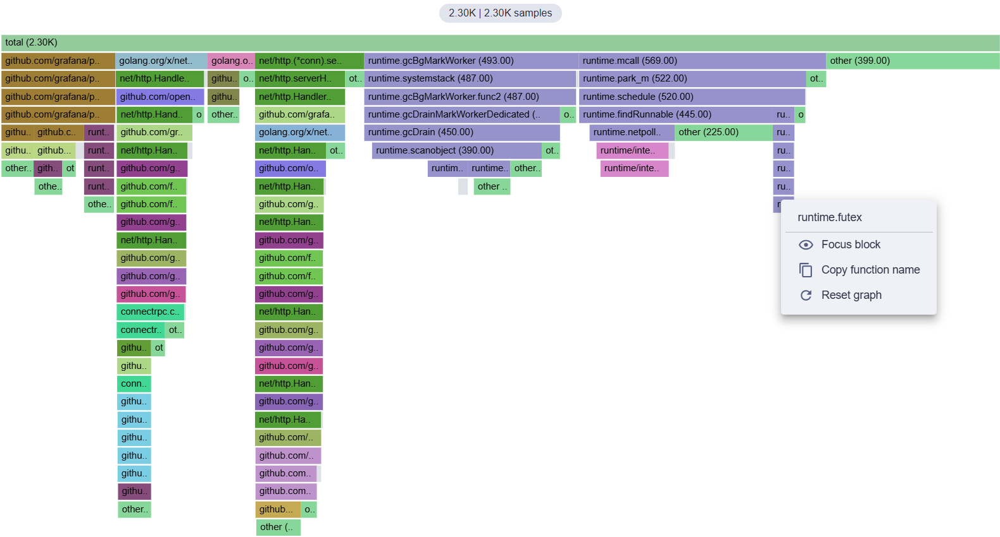

#### Table View

This panel displays the profile in a table format. It allows you to sort stacks, for example in descending order, to see
which function consume the most resources. A search bar is also present for filtering the table and highlighting stacks
in the flame graph.

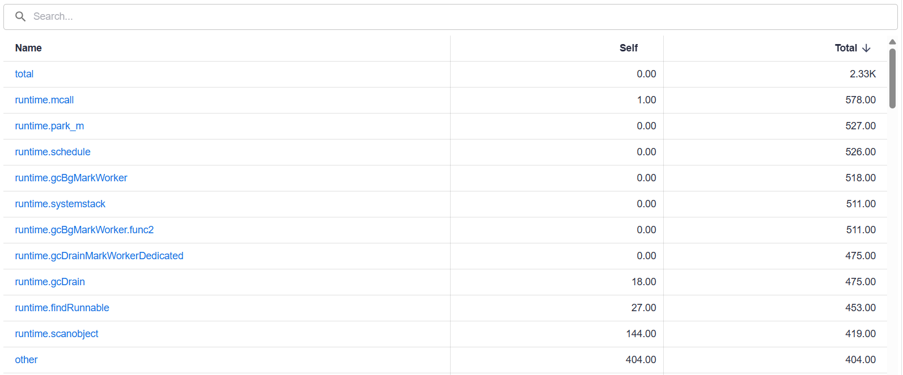

#### Series Chart

When retrieving profiles from the Pyroscope server, they include timeline data showing how the total amount of resources
consumed evolves over time, depending on the selected profile type. This panel allows you to visualize this data in
order to identify spikes in resource consumption (CPU, memory, etc.) and focus on them by zooming into the corresponding
time range.

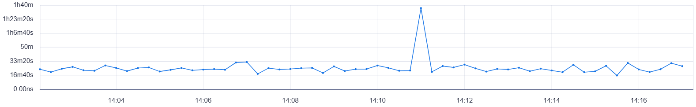

## New Logs plugins

This release introduces two new plugins enabling log visualization and exploration in Perses:

- **Loki**: a datasource plugin for retrieving and handling data from a Loki server.
- **Logs Panel**: a visualization plugin for displaying and exploring logs.

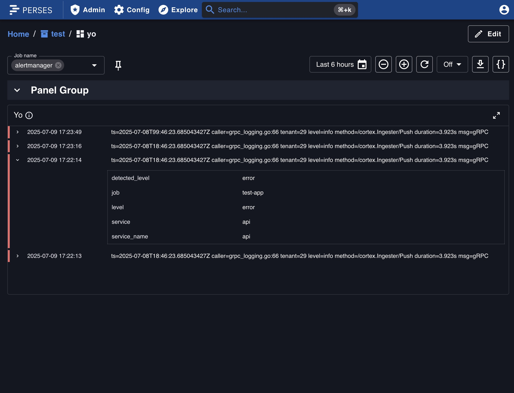

These new plugins have been developed by the Perses community.
A big thank you to [@abelyakin](https://github.com/abelyakin) !!

## Heatmap

As spoiled on the previous release note, the heatmap panel has been added on Perses!
It is now possible to visualize Prometheus native histograms in a heatmap format. This panel is particularly useful for
visualizing latency distributions over time.

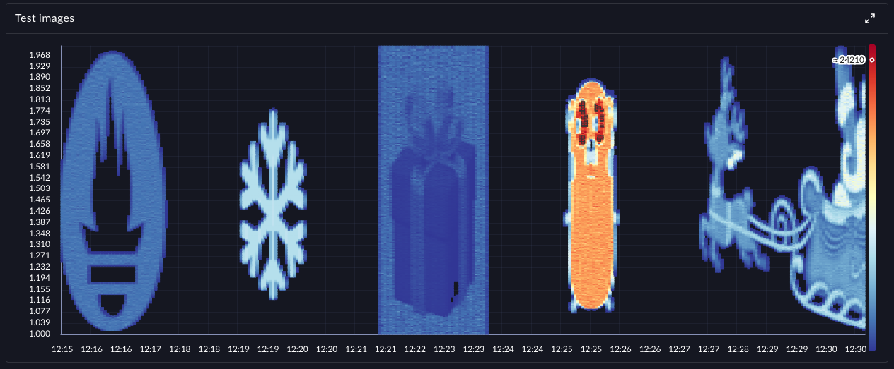
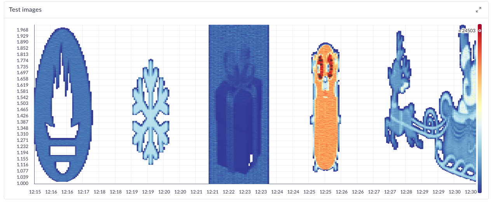

This panel still need to be improved, so stay tuned for future updates! Or even better, contribute to it! List of
improvements to be done can be found in the [GitHub issue #2978](https://github.com/perses/perses/issues/2978)

## Quick Query Viewer

Panels introduces a new feature called `Quick Query Viewer` using which users can quickly check the executed queries
without being in edit mode.
The feature has added a new, default icon button into the panel header. When clicked a modal is opened in which you can
see relevant query specs.

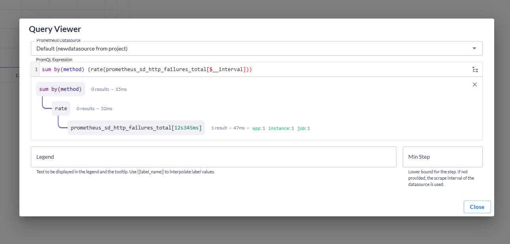

## Panel group repeat

Panel group now support variable repeat. This allows you to create a panel group and have it repeated for each value of
a variable.

You can define the repeat variable in the panel group settings dialog.
It will be also applied to preview in panel group.
When editing a panel inside a panel group with repeat, changes will be applied to all panels group repeated.

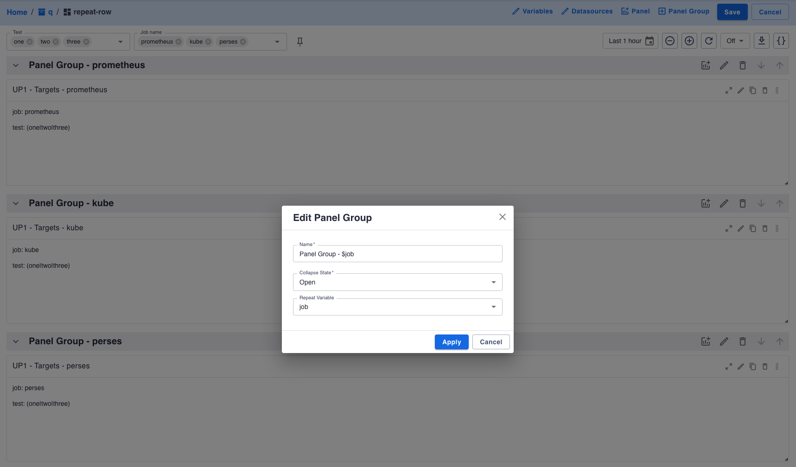
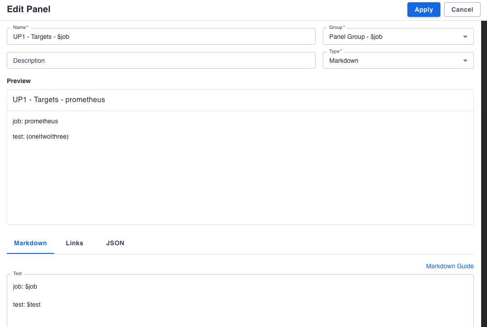

## User profile

We are introducing user profiles in Perses!

For the moment, the user profile page only contains the list of the permissions associated to the account used.
But it is the first step towards a more complete user profile page, which will include more functionalities in the
future.

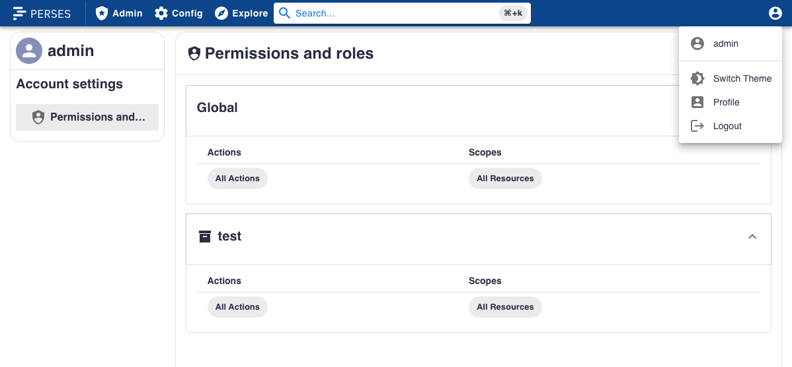

## Discard changes prompt

When editing a dashboard, if you try to leave the page with unsaved changes, a prompt will appear to warn you about
potential lost changes.
There are 2 different prompts depending on how you try to leave the page:

- If you try to navigate to another page in Perses, a modal will appear to confirm you want to leave the page.
- If you try to close the tab or navigate to another website, a browser native prompt will appear.

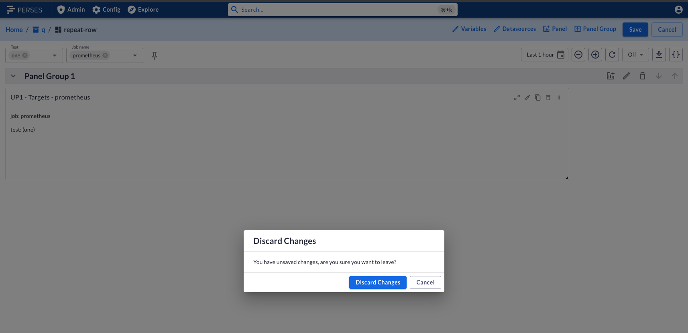
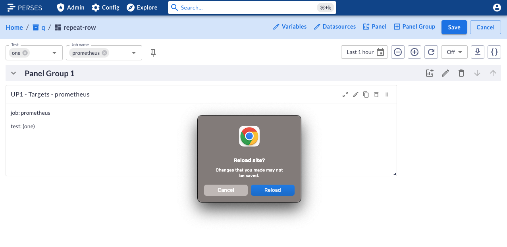

## Explorer improvements

Explorer can now show more information about your resources, thanks to collapsable tab menu!

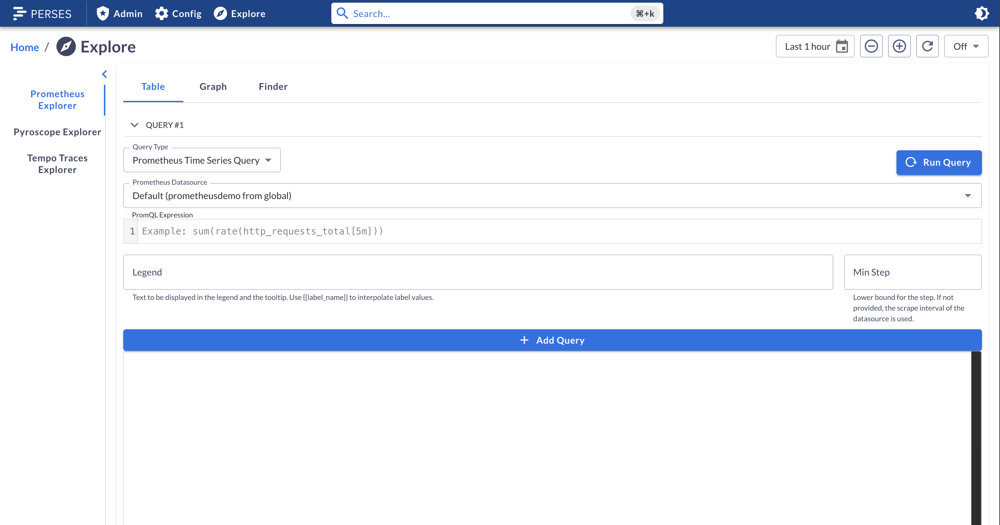
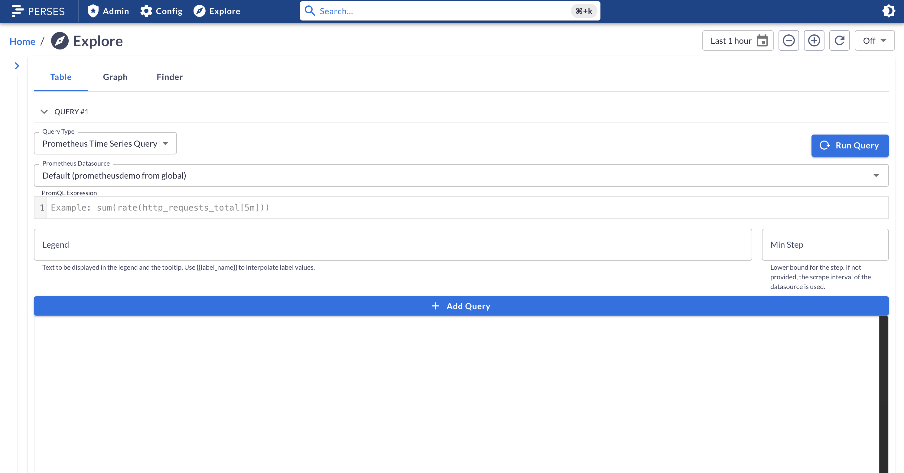

Few other improvements have been made to the explorer, such as:

- Tabs are now sorted alphabetically
- The metric finder datasource selector is rendered correctly
- Metric finder filter inputs are now displayed in 3 parts: key, operator, value. Instead of a single input.

## Plugins Improvements

### Traces

#### Attribute Search

The Tempo plugin now allows you to search for traces by attributes directly in the query editor, without writing a
TraceQL query manually.

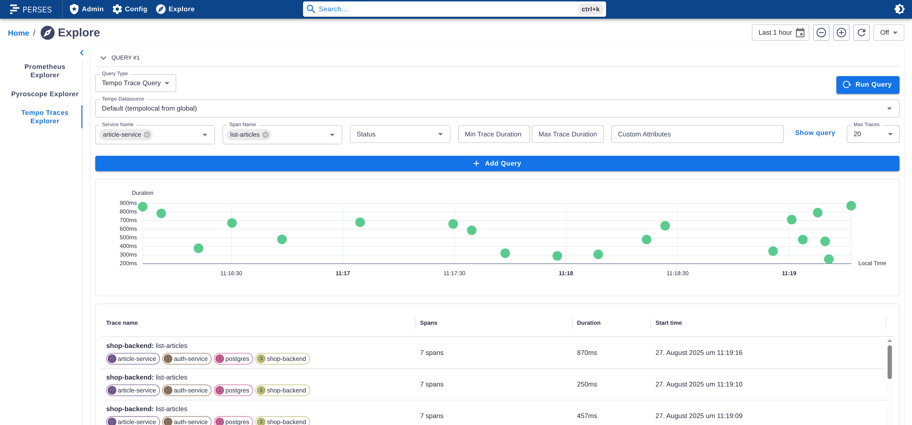

#### Span Links

You can now view span links in a new **Links** tab when clicking on a span which has links configured. This makes it
easier to explore related spans and understand trace relationships.

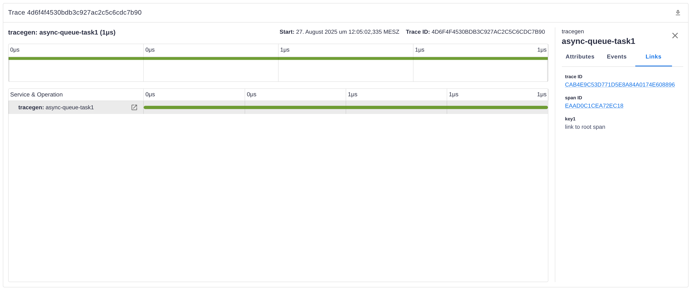

#### Download Traces

The TracingGanttChart panel now includes a download action in the panel header. With one click, you can export the
entire trace in OTLP/JSON format for offline analysis or sharing.

#### Linking Improvements

The TracingGanttChart, TraceTable, and ScatterChart panels now support configuring links in the panel spec. You can
configure the link to a specific trace (e.g. relevant for the trace table) or create dynamic links from resource and
span attributes (in the TracingGanttChart panel).

## CLI Improvements

### New command `percli plugin test-schema`

This new command provides a way to test the Cuelang schema and the migration schema. Here how it works:

First, all tests files needs to be placed directly alongside the schema file to test, within a `tests` folder.
Then you will have different way to test the schemas:

**Tests validating the model**:

- Validate that a JSON file is accepted by the plugin's CUE schema.
- Place valid tests under "tests/valid/". "tests" is located next to the entrypoint of the "model" CUE package.
- Each test is a JSON file containing a valid configuration expected to pass validation.

**Tests verifying invalid possibility**:

- Validate that a JSON file is rejected by the plugin's CUE schema.
- Place invalid tests in "tests/invalid/". "tests" is located next to the entrypoint of the "model" CUE package.
- Each test is a JSON file containing an invalid configuration expected to fail validation.

**Migration Tests**:

- Validate migration logic defined in the plugin's "migrate.cue" file.
- Place migration tests under "migrate/tests/". "tests" is located next to "migrate.cue".
- Each test is a directory containing:
    - "input.json": The source file (e.g., Grafana format).
    - "expected.json": The expected result after migration (Perses format).
- The migration test unifies the input with the migration schema and compares the result to the expected output.

Example of file structure for a single plugin:

```tree
schemas/
├── model.cue
├── tests/
│   ├── valid/
│   │   ├── basic-config.json
│   │   └── advanced-config.json
│   └── invalid/
│       ├── missing-required.json
│       └── invalid-type.json
└── migrate/
├── migrate.cue
└── tests/
├── basic-migration/
│   ├── input.json
│   └── expected.json
└── complex-migration/
├── input.json
└── expected.json
```

More complex example for a package embedding several plugins:

```tree
schemas/
├── my-datasource/
│   ├── model.cue
│   ├── tests/
│   │   ├── valid/
│   │   │   ├── basic-config.json
│   │   │   └── advanced-config.json
│   │   └── invalid/
│   │       ├── missing-required.json
│   │       └── invalid-type.json
│   └── migrate/
│       ├── migrate.cue
│       └── tests/
│           ├── basic-migration/
│           │   ├── input.json
│           │   └── expected.json
│           └── complex-migration/
│               ├── input.json
│               └── expected.json
└── my-query/
├── model.cue
├── tests/
│   ├── valid/
│   └── invalid/
└── migrate/
├── migrate.cue
└── tests/`,
```

### Improvement of the command `percli plugin start`

This command has been improved to provide a better experience when starting a plugin locally.

Note: all improvement described below will only work with a remote server of version >= 0.52.0 as it also included new
endpoints to make the features work.

1. With this new version, the command is now able to detect any changes on the Cuelang schema.
   When a change is detected, the command will trigger the remote server to reload the schema internally.
   This improvement is particularly useful during the development of a plugin, as it allows to see the changes of the
   schema immediately without having to manually restart the server and the plugin watching process.

2. When stopping the command, it will now unregister any plugin it was watching. This is useful to avoid having to
   restart the remote server to get back the list of registered plugins clean. It also solve an issue about being able
   to override a plugin with the development version of the same plugin.
