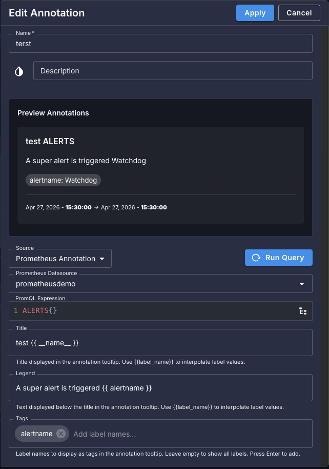
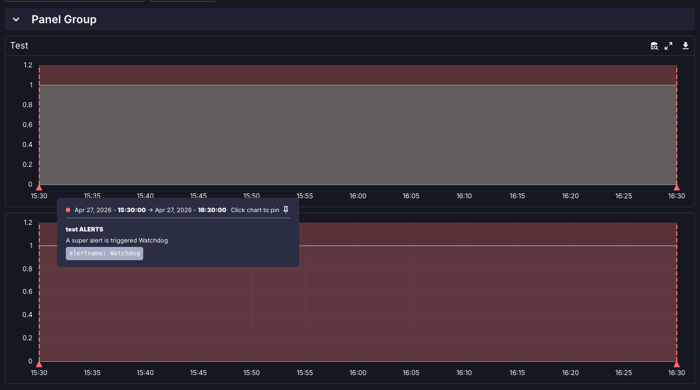

# Release v0.54.0

Welcome to Perses v0.54.0! In this release, on top of many improvements and bug fixes, we have introduced several
changes that break compatibility with previous versions. Please review the breaking changes section carefully before
upgrading.

These changes have been carefully considered to improve the overall user experience and maintainability of Perses. We
hope that, even though they may make the upgrade process a bit more complex, you will stay with us and enjoy the
benefits of these improvements.

While you can read this blog post for details about the changes and how to upgrade, we are also providing a
[migration guide](https://perses.dev/perses/docs/upgrade-guide/) that is more condensed and focused on the steps
required to upgrade from previous versions to v0.54.0.

<!-- more -->

## Introduction of the Perses specification

We have created a new repository called [perses/spec](https://github.com/perses/spec) that contains the Dashboard and
Datasource specifications in different languages (Go, TypeScript, Cuelang).

The goal of this repository is to provide a single source of truth for the specifications and make it easier for
developers to work with them in different programming languages, independently of the Perses project.

The specifications are now used in the Perses app, the Go and CUE SDKs, and the CLI. This means that if you use the
SDKs and/or the CLI, you will need to update your code to use the new specifications and upgrade the CLI to
v0.54.0.

## Package `@perses-dev/core` deprecation

As part of the introduction of the Perses specification, we are deprecating the package `@perses-dev/core`. We have
created a final version of this package that is compatible with the new specifications and will be available in the
npm registry. However, we recommend migrating your code to use the new specifications instead of using this
package.

Also, if you are using the `@perses-dev/core` package in your code, you may be using more than just the specifications.
In this case, you will also need to update your imports to use the new `@perses-dev/client` package.

Please read the [migration guide](https://perses.dev/perses/docs/upgrade-guide/) for more details about how to migrate
your code to use the new specifications and the new package.

## Enable or disable plugins through configuration

As we are adding more and more plugins to Perses, we have introduced a new configuration option to enable or disable
plugins. This gives users more fine-grained control over which plugins are available in their Perses instance and
reduces noise and issues caused by unused plugins.

For example, with the following configuration:

```yaml
plugin:
  disabled:
    - "pyroscope"
    - "victoriaLogs"
    - "clickHouse"
    - "tempo"
```

Prometheus will be the only datasource enabled in the default Perses installation.

Another way to achieve the same result is to explicitly enable only the plugins you want to use:

```yaml
plugin:
  enabled:
    - "prometheus"
```

In this example, only the Prometheus plugin will be enabled and all other plugins will be disabled.

As a consequence of this configuration, every associated panel, variable, and query is also disabled.

This also means that if you add a new plugin in the future, it will be disabled by default, and you will need to
explicitly enable it in the configuration.

## Annotations

Perses now supports annotations, which add information such as events to panels. Panels must support annotations; for
now, only the TimeSeries Chart panel does. In addition, only annotations from Prometheus (using PromQL) are supported.
Thanks to the Perses plugin architecture, support for annotations can easily be added to any datasource or panel.





## Keyboard shortcuts

TODO

## Sub-folder support

TODO

## New plugins

TODO

### Jaeger

TODO

### GreptimeDB

TODO

### Splunk

TODO

### Alertmanager

TODO

### LogExporter

TODO

<!-- Add more section if necessary -->
