# Release v0.54.0

Welcome in the v0.54.0 release !

First of all this release includes several security fixes that patches some breach in the permission system included in
Perses, so we strongly recommend to upgrade to this version as soon as possible.

Then, you will be happy to know that this release includes new plugins: Jaeger, GreptimeDB, Splunk, LogExplorer,
AlertManager and OpenSearch.

As adding more plugins is increasing the size of the container image, likely we will remove some of them in future
release. It does not mean we will remove the support for these plugins, it is just we won't include them into the
default image. You will have to add them manually. The drop will occur once we are able to provide a good way to add
plugins to an existing installation without having to rebuild the image. In the meantime, if you don't want to use these
plugins, you can choose to enable or disable them by configuration.

We are also happy to announce it includes the long awaited sub-folder system to better organize your dashboards and
improve the accessibility by adding keyboard shortcuts.

This release is also the last release for the package `@perses-dev/core` that is now deprecated. For that we are
introducing two new packages `@perses-dev/spec` and `@perses-dev/client`.

- `@perses-dev/spec` contains the dashboard and datasource specifications.
- `@perses-dev/client` contains the client to interact with the Perses API.

The code from `@perses-dev/core` has been dispatched in these these two packages and in others (like
`@perses-dev/plugin-system` and `@perses-dev/components`) to better separate the concerns and make it easier to
maintain.

Finally, thank you to all the contributors who made this release possible, you are more and more, and we are really
happy to see the community growing and contributing to make Perses better and better!

As usual, this blog post does not cover all the changes and improvements included in this release. We are only talking
about the changes that should interest you the most. If you want to have a complete list of all the changes, please
refer to the [changelog](https://github.com/perses/perses/releases/tag/v0.54.0)

<!-- more -->

## Security issues

On top of the various features and improvements, we have fixed several security issues in this release that compromised
the permission system of the Perses application. We strongly recommend to upgrade to this version as soon as possible.

### Use query parameter project to list resources without having access to ([CVE-2026-63458](https://github.com/perses/perses/security/advisories/GHSA-cjgj-2fwf-4c2w))

In previous versions, it was possible to list resources (dashboards, datasources, etc.) that you don't have access to by
using the query parameter `project` in the API.

For example, if you have access to the project `project-a` but not to `project-b`, you could list all dashboards in
`project-b` by calling the API endpoint `/api/v1/dashboards?project=project-b`. This would return a list of dashboards
in `project-b` even if you don't have access to that project.

Now, if you try to list resources that you don't have access to, you will get a 403 Forbidden error.

### Unvalidated project parameter enables filesystem path traversal ([CVE-2026-63445](https://github.com/perses/perses/security/advisories/GHSA-vr5f-w35q-98jp))

In previous versions, it was possible to use the `project` query parameter to access files outside the Perses
installation directory. This could be exploited by an attacker to read sensitive files on the server.

It was also possible to use this query parameter to get access to other resources contained in the database by using a
project name that contains a path traversal sequence (e.g. `../secrets`).

For example `/api/v1/dashboards?project=../projects` returns the list of the project while it must not return anything.

Now, if you try to use a project name that contains a path traversal sequence, you will get a 400 Bad Request error.

Note that this attack is not possible if you are using an SQL database instead of the default fileSystem database.

### Missing authorization in datasource proxy allows cross-scope secret disclosure ([CVE-2026-63199](https://github.com/perses/perses/security/advisories/GHSA-4227-9989-jrhx))

In previous versions, it was possible to contact datasources protected by secrets that you don't necessary have access
to by using the datasource proxy.

This was because the datasource proxy did not check if you have access to the secret used to connect to the datasource
while testing the connection to the same datasource.

Now, if you are creating a datasource or testing a connection to a datasource, the datasource proxy will check if you
have access to the secret used to connect to the datasource. If you don't have access to the secret, you will get a 403
Forbidden error.

## Introduction of the Perses specification

We have created a new repository called [perses/spec](https://github.com/perses/spec) that contains the Dashboard and
Datasource specifications in different languages (Go, TypeScript, Cuelang).

The goal of this repository is to provide a single source of truth for the specifications and make it easier for
developers to work with them in different programming languages, independently of the Perses project.

The specifications are now used in the Perses app, the Go and CUE SDKs, and the CLI. This means that if you use the SDKs
and/or the CLI, you will need to update your code to use the new specifications and upgrade the CLI to v0.54.0.

## Package `@perses-dev/core` deprecation

As part of the introduction of the Perses specification, we are deprecating the package `@perses-dev/core`. We have
created a final version of this package that is compatible with the new specifications and will be available in the npm
registry. However, we recommend migrating your code to use the new specifications instead of using this package.

Also, if you are using the `@perses-dev/core` package in your code, you may be using more than just the specifications.
In this case, you will also need to update your imports to use the new `@perses-dev/client` package.

Please read the [migration guide](https://perses.dev/perses/docs/upgrade-guide/) for more details about how to migrate
your code to use the new specifications and the new package.

## Enable or disable plugins through configuration

As we are adding more and more plugins to Perses, we have introduced a new configuration option to enable or disable
plugins. This gives users more fine-grained control over which plugins are available in their Perses instance and
reduces noise and issues caused by unused plugins.

For example, with the following configuration:

```yaml
plugin:
  disabled:
    - "pyroscope"
    - "victoriaLogs"
    - "clickHouse"
    - "tempo"
```

Prometheus will be the only datasource enabled in the default Perses installation.

Another way to achieve the same result is to explicitly enable only the plugins you want to use:

```yaml
plugin:
  enabled:
    - "prometheus"
```

In this example, only the Prometheus plugin will be enabled and all other plugins will be disabled.

Note that, a consequence of this configuration is that every panels, variables and queries are also disabled.

This also means that if you add a new plugin in the future, it will be disabled by default, and you will need to
explicitly enable it in the configuration.

## Annotations

Perses now supports annotations, which add information such as events to panels.

Panels must support annotations; for now, only the TimeSeries Chart panel does. In addition, only annotations based on
Prometheus PromQL are supported. However, thanks to the Perses plugin architecture, support for annotations can easily
be added to any datasource (as source of data) or panel (for the display).

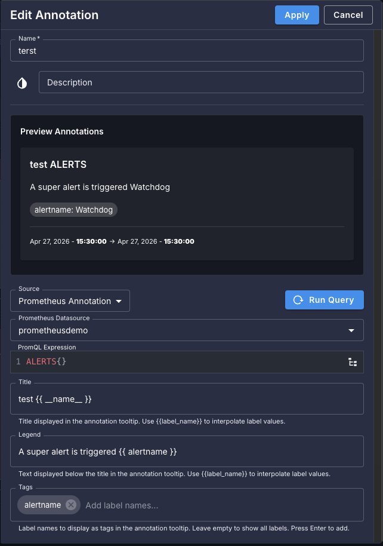
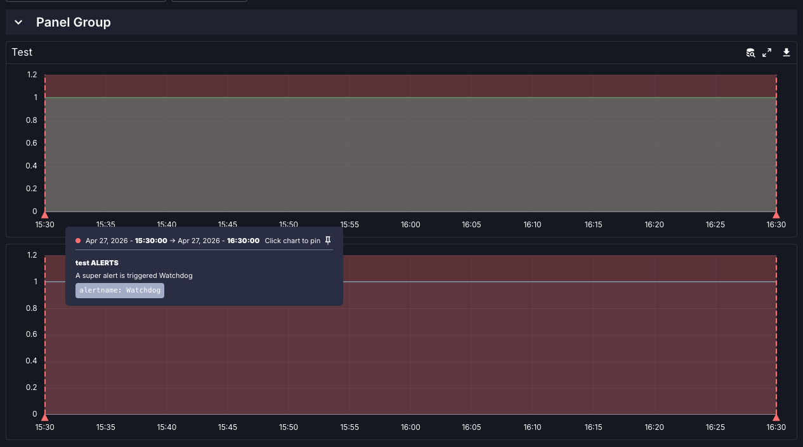

## Keyboard shortcuts

Perses v0.54.0 introduces built-in keyboard shortcuts to help you navigate and operate dashboards faster without having
to using a mouse. Press `?` anywhere in the UI to open the shortcuts help modal, which lists all available shortcuts
grouped by category.

Some highlights:

- **`?`** — Open the keyboard shortcuts help modal
- **`Ctrl`/`⌘` + `K`** — Open the search dialog
- **`G` + `H`** — Go to the Home page
- **`Ctrl`/`⌘` + `S`** — Save the current dashboard
- **`D` + `M`** — Toggle between edit and view mode
- **`E`** — Edit the focused panel (in edit mode)
- **`V`** — Toggle fullscreen on the focused panel

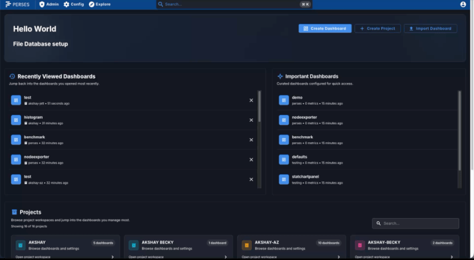

Keyboard shortcuts are enabled by default. To disable them, set the following in your Perses configuration:

```yaml
frontend:
  enable_keyboard_shortcuts: false
```

## Sub-folder support

Perses now supports folders — a way to organise dashboards within a project using a tree structure. A folder's
`spec.items` can contain both dashboard references and nested subfolders, allowing you to mirror how your teams
structure their observability content.

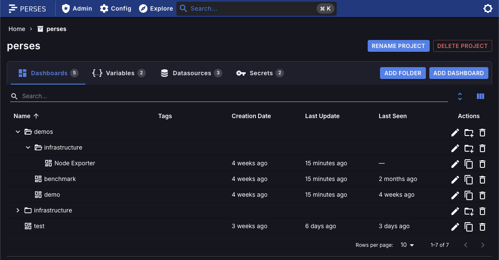

The project's dashboard list displays dashboards in a tree view, where you can browse, create, edit, and delete folders
and subfolders. The same operations are available through the API and CLI (`percli apply`, `percli get folder`, etc.).

For example, the `demos` folder visible in the screenshot above is defined as:

```json
{
  "kind": "Folder",
  "metadata": {
    "name": "demos",
    "project": "perses"
  },
  "spec": {
    "items": [
      {
        "kind": "Dashboard",
        "name": "demo"
      },
      {
        "kind": "Dashboard",
        "name": "benchmark"
      },
      {
        "kind": "Folder",
        "name": "infrastructure",
        "items": [
          {
            "kind": "Dashboard",
            "name": "nodeexporter"
          }
        ]
      }
    ]
  }
}
```

## New plugins

TODO

### OpenSearch

This version of Perses now ships a bundled OpenSearch datasource along with a LogQuery plugin. Users can now query and
view their logs directly in a Perses dashboard, right next to the other panels with metrics and traces.

Connecting to an existing OpenSearch cluster is easy, using either a proxy or a direct connection. The recommended setup
routes requests through the Perses backend proxy: the browser talks to Perses and Perses talks to OpenSearch, so any
credentials stay server-side and you don't need to enable CORS on your cluster. A direct connection is also available
for local experimentation.

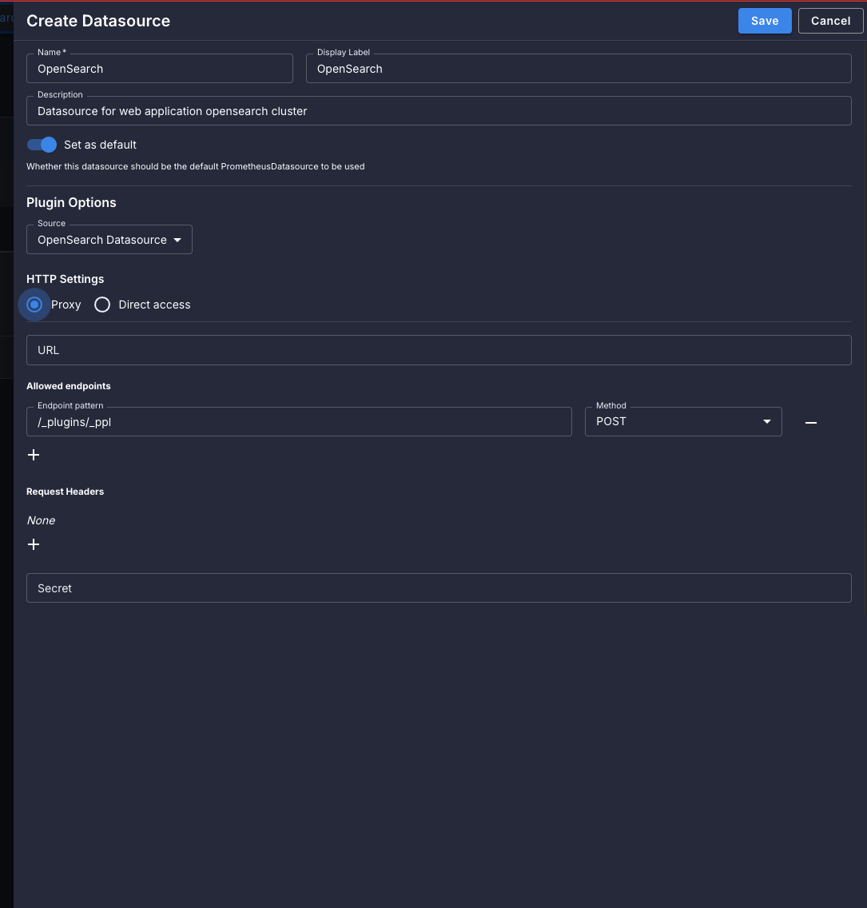

Logs are queried
with [PPL (Piped Processing Language)](https://opensearch.org/docs/latest/search-plugins/sql/ppl/index/). You add a
**Logs Table** panel, pick the **OpenSearch Log Query** query type, point it at an index pattern, and write a PPL
query — for example, showing the most recent `ERROR` lines from a service.

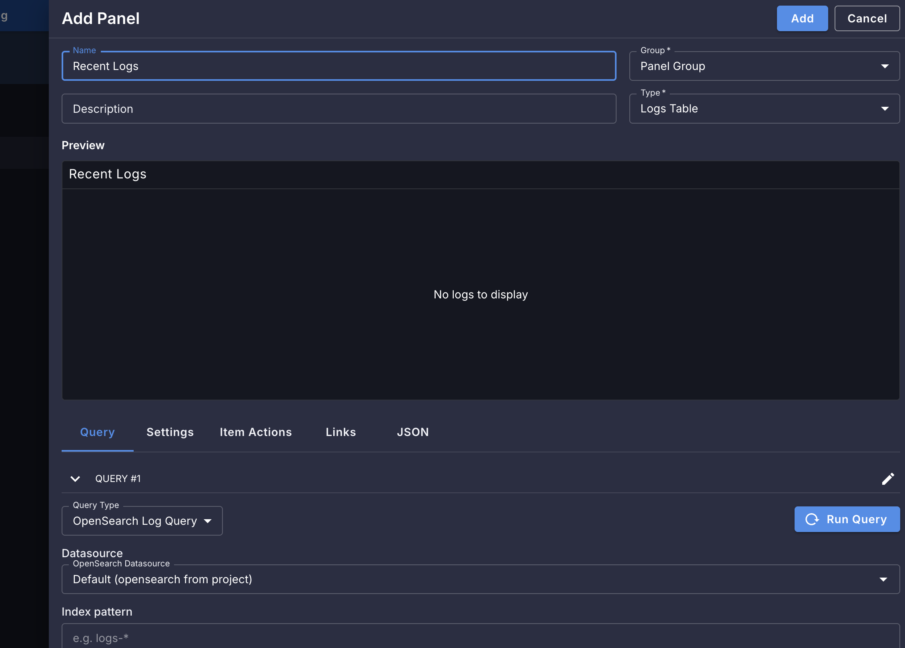

Results are rendered as log entries, with every other column in the row kept as a label so you can filter and display
fields like `service.name`, `severityText`, or `traceId`. You can drop several log panels on a single dashboard. For
instance, a broad "Recent Logs" view alongside a filtered "Error Logs" one.

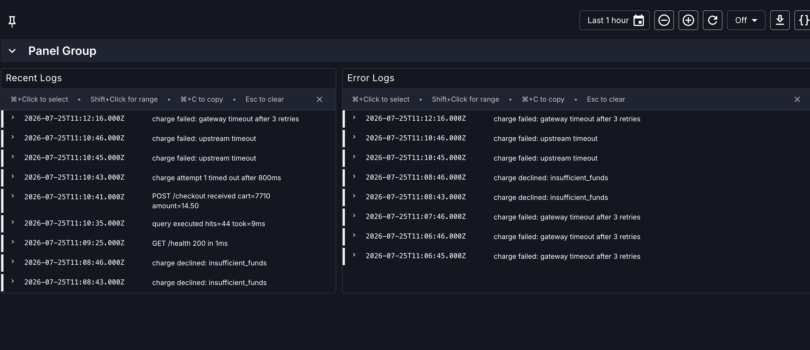

A couple of things happen automatically to make this feel native. Queries are bound to the dashboard's current time
range. The plugin injects a timestamp filter for you, so the logs follow the time picker (you can turn this off per
query). And because OpenSearch indices are schema-flexible, the plugin auto-detects the timestamp and message fields
from common names, with per-query overrides when your index uses different ones. Since `traceId` is just another field,
you can even setup an OpenSearch logs panel next to a Tempo or Jaeger trace panel on the same dashboard and pivot from a
trace straight to the logs it produced.

### Jaeger

TODO

### GreptimeDB

This release adds support for GreptimeDB as a datasource in Perses.
> GreptimeDB is an open-source observability database built for Observability 2.0 — treating metrics, logs, and traces as one unified data model (wide events) instead of three separate pillars.

With this integration, you can run log, trace, and time series queries against GreptimeDB directly from Perses dashboards.

The images below show a dashboard example and the corresponding query editors.

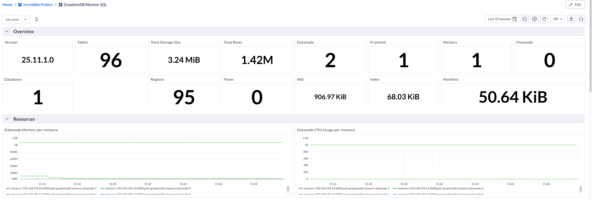

| GreptimeDB Log Query | GreptimeDB Time Series Query |
| --- | --- |
| 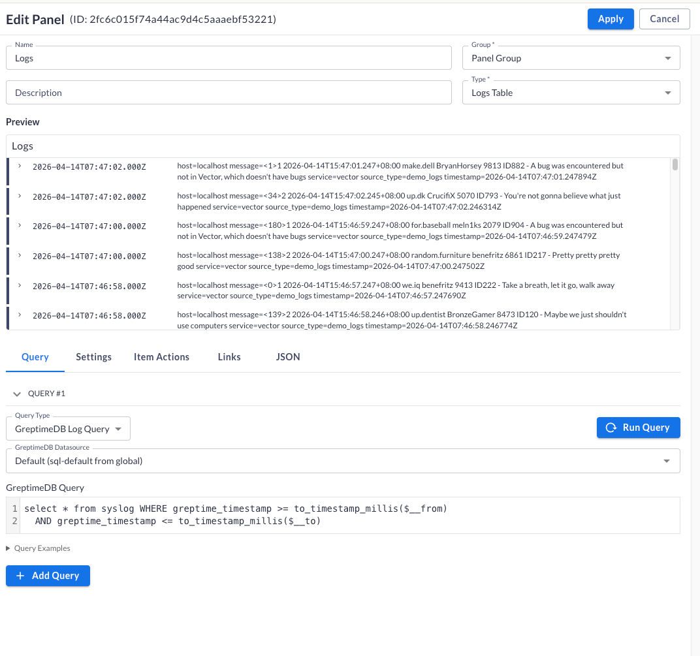 | 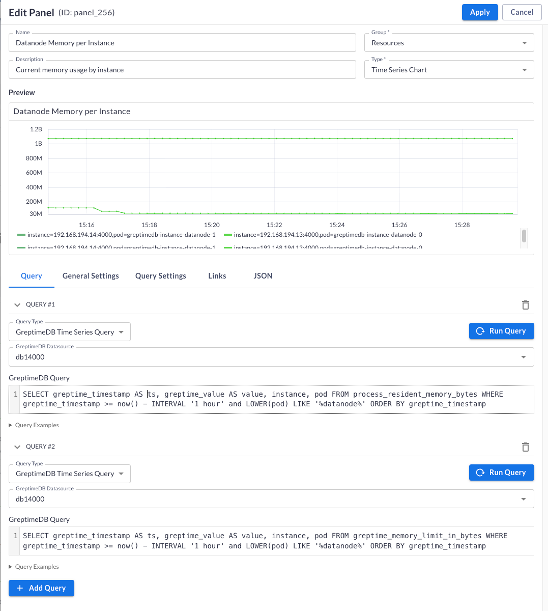 |

### Splunk

Perses now supports Splunk as a datasource, bringing Splunk's search capabilities directly into your Perses dashboards.

The Splunk plugin lets you connect to Splunk Enterprise or Splunk Cloud and query data using SPL (Splunk Processing
Language) — the same query language you already use in Splunk. Once connected, you can visualize results as time series
charts or explore raw log data, all within the Perses UI.

Time Series Queries - Run SPL queries (e.g., timechart) and render results in Perses panel that accepts time series
data.
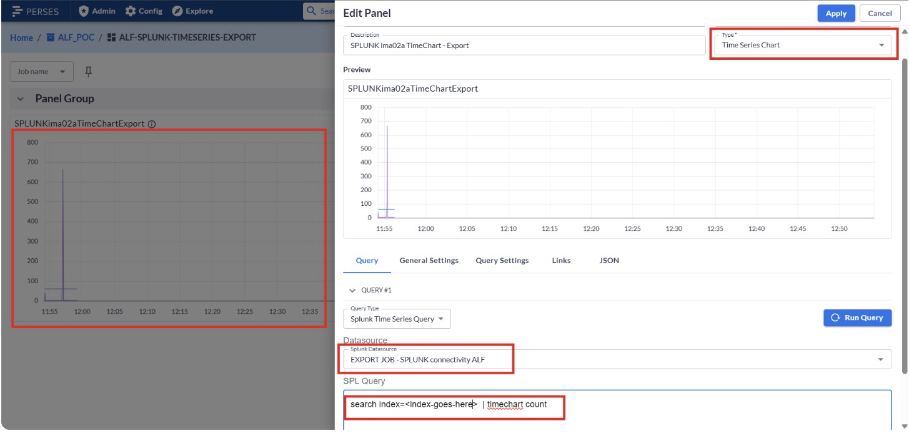

Log Queries - Retrieve and display log results from Splunk indexes directly in a logs panel.
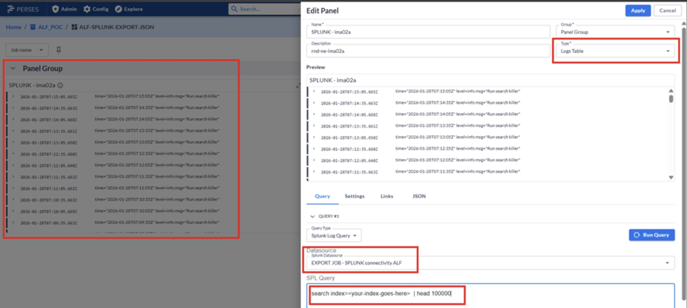

### Alertmanager

Perses now supports [Alertmanager](https://prometheus.io/docs/alerting/latest/alertmanager/) as a datasource. This
allows you to visualize and manage alerts and silences directly from a Perses dashboard.

The new Alert Table allows you to view, search, group, filter and silence alerts. It also allows to confgure custom
columns and label coloring, as many alert queries can be included for a single table it also supports deduplication.

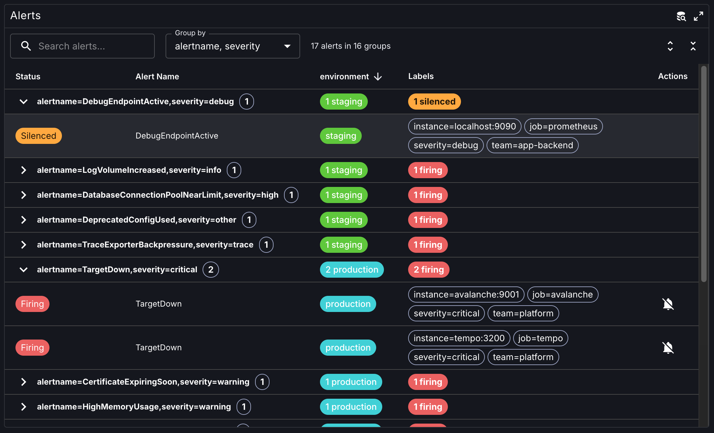

The new Silence Table allows you to view, search and expire silences. It also allows to configure its columns.

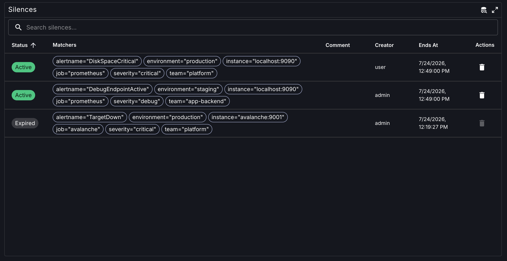

### Log Explorer

Perses has been extended with a generic Log Explorer. This allows you to visualize and explore logs from any datasource
that supports logs, such as Loki, VictoriaMetrics, ClickHouse, GreptimeDB, etc.

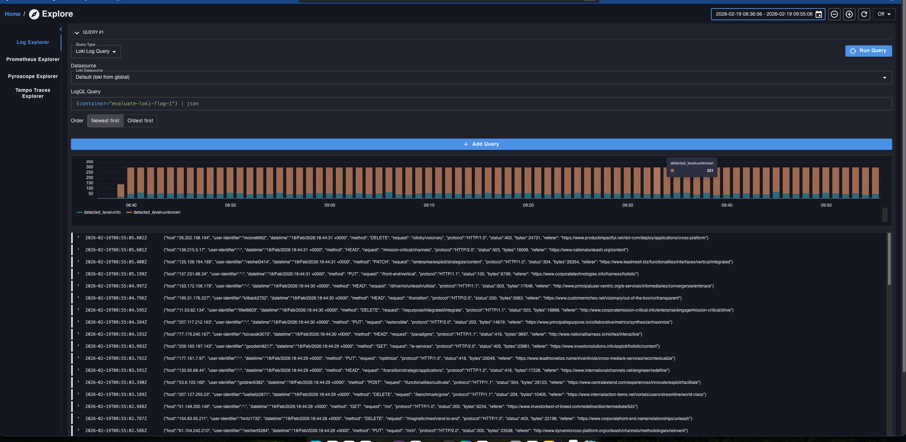

This is a really great addition to Perses, as it will avoid the need to implement an explorer for each datasources
supporting logs.

We are thinking about doing the same for traces in the future, but we are still evaluating the best approach to do so.


