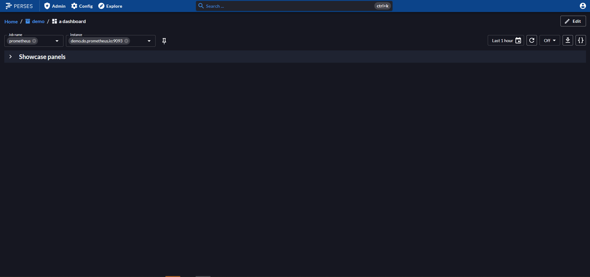

---
hide:
  - navigation
  - toc
  - search
  - path
title: Perses
---
<!-- below css is required to remove the empty header that is generated automatically by mkdocs ref: https://github.com/squidfunk/mkdocs-material/issues/2163#issuecomment-2109733111-->

 
## An open specification for dashboards. The open dashboard tool for Prometheus and other data sources.

-   ## Observability display

    ---

    Perses is first and foremost a dashboard tool that you can use to display a variety of observability data. Today supports Prometheus metrics & Tempo traces.

-   ## Embeddable components

    ---

    You can use Perses as-is or embed parts of it in your own UI, could it be a single panel or a whole dashboard view.

-   ## GitOps-friendly

    ---

    Perses offers a complete static validation of the dashboard format. It also comes with a CLI, `percli`, that can be used to perform actions in CI/CD pipelines.

-   ## Scale-friendly 

    ---

    Perses dashboards can be written as-code using the provided SDKs. This enables to define any kind of components in libraries, from simple color codes to complex templates, for reusage across as much dashboards as you want. 

-   ## Kubernetes-native

    ---

    Use the Perses operator to manage your Perses deployments & dashboards as CRDs. Leverage on the datasource discovery to retrieve data from your datasource pods/services.

-   ## Extensible

    ---

    Perses, with its plugin-based architecture, offers effortless extension and reuse of plugins across different projects.

...and more to discover!

## Open Source

Perses is 100% open source and community-driven. All components are available under the [Apache 2.0 License](http://www.apache.org/licenses/LICENSE-2.0) on [GitHub](https://github.com/perses).

Perses is a [Cloud Native Computing Foundation](https://cncf.io) sandbox project.

 

## Used by

-    
-    
-   
-    
-    

