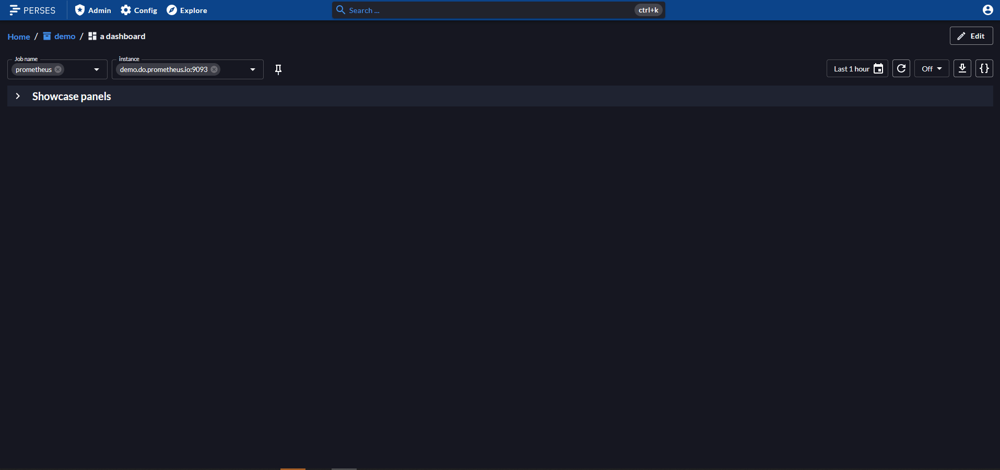
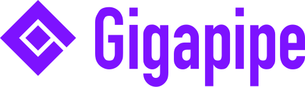

---
hide:
  - navigation
  - toc
  - search
  - path
title: Perses
---

<!-- below css is required to remove the empty header that is generated automatically by mkdocs ref: https://github.com/squidfunk/mkdocs-material/issues/2163#issuecomment-2109733111-->

 
## An open specification for dashboards. The open dashboard tool for Prometheus and other data sources.

-   ## Observability display
    ---
    Perses is first and foremost a dashboard tool that you can use to display a variety of observability data. Today supports Prometheus metrics & Tempo traces.

-   ## Embeddable components
    ---
    You can use Perses as-is or embed parts of it in your own UI, could it be a single panel or a whole dashboard view.

-   ## DevOps-ready
    ---
    Perses offers a complete static validation of the dashboard format. It also comes with a CLI, `percli`, that can be used to perform actions in CI/CD pipelines.

-   ## Scale-friendly
    ---
    Perses dashboards can be written as code using the provided SDKs, enabling you to manage large numbers of dashboards at scale.

-   ## Kubernetes-native
    ---
    Use the Perses operator to manage your Perses deployments & dashboards as CRDs. Leverage on the datasource discovery to retrieve data from your datasource pods/services.

-   ## Extensible
    ---
    Perses, with its plugin-based architecture, offers effortless extension and reuse of plugins across different projects.

...and more to discover!

## Visualize your data

{{ feature(
    title="Monitoring with Prometheus",
    description="Perses provides comprehensive Prometheus support with specialized panels for metrics visualization. It also comes with a built-in metrics explorer and a PromQL debugger that mirror Prometheus's native UI experience.",
    media="assets/images/home/monitoring.mp4"
) }}

{{ feature(
    title="Tracing with Tempo",
    description="Deep dive into your Tempo traces and display them in several ways: scatter plots, Gantt charts, or tables.",
    media="assets/images/home/tracing.mp4",
    reverse=True
) }}

## Open ecosystem

{{ feature(
    title="Open specification for dashboards",
    description="Perses is also an initiative to define a standardized dashboard specification, fostering interoperability across observability tools.",
    media="assets/images/home/open_spec.png",
    reverse=True
) }}

{{ feature(
    title="Embeddable components",
    description="Perses provides various npm packages that allow developers to embed panels and dashboards into their own UIs, giving the flexibility to integrate Perses components without running the full application.",
    media="assets/images/home/embeddable_components2.png",
    learn_more="perses/docs/embedding-panels.md"
) }}

{{ feature(
    title="Plugins",
    description="Perses supports multiple kinds of plugins, enabling users to extend the tool’s native capabilities to suit specific needs.",
    media="assets/images/home/plugins.png",
    learn_more="perses/docs/concepts/plugin.md",
    reverse=True
) }}

## DevOps-ready

{{ feature(
    title="percli",
    description="Perses comes with a native CLI, `percli`, which can be used to perform many kinds of actions in CI/CD pipelines.",
    media="assets/images/home/percli.png",
    learn_more="perses/docs/cli.md",
) }}

{{ feature(
    title="Dashboard-as-Code",
    description="Perses dashboards can be written as code using the provided SDKs. This enables you to define reusable components in libraries or leverage existing community libraries, from simple color codes to complex templates, for reuse across as many dashboards as you want.",
    media="assets/images/home/dac.png",
    learn_more="perses/docs/concepts/dashboard-as-code.md",
    reverse=True
) }}

{{ feature(
    title="Static validation",
    description="Perses offers complete static validation of the dashboard format, which you can also extend with custom lint rules.",
    media="assets/images/home/static_validation.png",
    learn_more="perses/docs/cli.md#linter",
) }}

{{ feature(
    title="Perses operator",
    description="Deploy and manage Perses instances and dashboards declaratively using Kubernetes Custom Resources, enabling GitOps workflows and seamless integration with your existing K8s infrastructure.",
    media="assets/images/home/perses_operator.png",
    learn_more="https://github.com/perses/perses-operator/blob/main/docs/api.md",
    reverse=True
) }}

{{ feature(
    title="Datasource discovery",
    description="Automatically discover and register datasources through HTTP services or Kubernetes API, eliminating manual configuration effort in dynamic environments.",
    media="assets/images/home/datasource_discovery.png",
    learn_more="perses/docs/configuration/datasource-discovery.md",
) }}

## And more

{{ feature(
    title="Secure your access",
    description="Perses provides comprehensive authentication and authorization capabilities. Choose from native user management or integrate with external OIDC/OAuth identity providers. Control access with Kubernetes-inspired RBAC system featuring roles, role bindings, and fine-grained permissions across projects and global resources.",
    media="assets/images/home/auth.png",
    learn_more="perses/docs/concepts/authentication.md",
    reverse=True
) }}

{{ feature(
    title="Grafana migration",
    description="Seamlessly migrate your existing Grafana dashboards to Perses, using either the web UI to import JSON files directly or leveraging `percli` for batch migrations. The migration process translates Grafana definitions to their Perses equivalents on a best-effort basis.",
    media="assets/images/home/grafana_migration.mp4",
    learn_more="perses/docs/migration.md"
) }}

{{ feature(
    title="Resources scopes",
    description="Organize datasources and variables across three hierarchical scopes: global (available everywhere), project (shared within a project), and dashboard (specific to one dashboard). Lower scopes automatically override higher ones, enabling flexible resource reuse while allowing targeted customization for specific use cases.",
    media="assets/images/home/resources_scopes.png",
    learn_more="perses/docs/concepts/datasource-and-variable-scopes.md",
    reverse=True
) }}

<!-- Add more features as needed, alternating image and text order for each block -->

## Open Source

Perses is 100% open source and community-driven. All components are available under
the [Apache 2.0 License](http://www.apache.org/licenses/LICENSE-2.0) on [GitHub](https://github.com/perses).

Perses is a [Cloud Native Computing Foundation](https://cncf.io) sandbox project.

 

## Adopters

-  
-  
- 
-  
- 
-  
-  
-  
- 
- [Your company logo here](./adopters.md)

